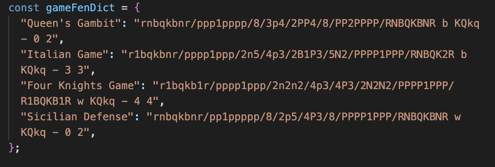

# chess-your-opening-frontend

Chess Your Opening is an application in which a user can see a list of openings and from there choose which to add to their studies. In the studies, the user is able to have more in depth information about the opening such as common moves and positions, as well as games played by high level players in which that opening is used.

In a study, the user has access to the resources and common positions that they can see if they click in the individual studies, but they also get access to chess games of high level players in which they used that opening. They are also able to write notes about the opening or anything else.

- A user is able to create and delete studies.

This git hub repo contains the front end for the application and the back end can be found [here](https://github.com/avrrodriguez/chess-your-opening).

The front end is a multi-page application that was built using React, bootstrap, and npm.

- Bootstrap was used to style the different pages.
- Axios was used to make requests to a third party API, from which example chess games for the openings were obtained.
- Through the chess games and lichess embed, interactive games in which one can go to any move and go move by move was available for the user to use.

JSON web token authentications was used to create secure users.

- A non-user of the application has access to the list of openings, limited additional information about each opening, and public studies.
- A user has access to the list of openings, as well as the ability to create studies.
- An admin has access to creating, updating, deleting openings, resources, and common positions of openings.

## Usage

```
npm run dev
```

When adding openings, to get live games, add fen to ChessGames file in gameFenDict variable


To add Image to openings, common positions, add the image url in the image url section


## Roadmap

- Chess board for playing custom games/games against computer
- Dynamically adding fen and generating games when adding openings
- Allowing users to change the status of their studies(either public or private)
- Search bar for searching for openings
- Making notes update upon change (no button)
